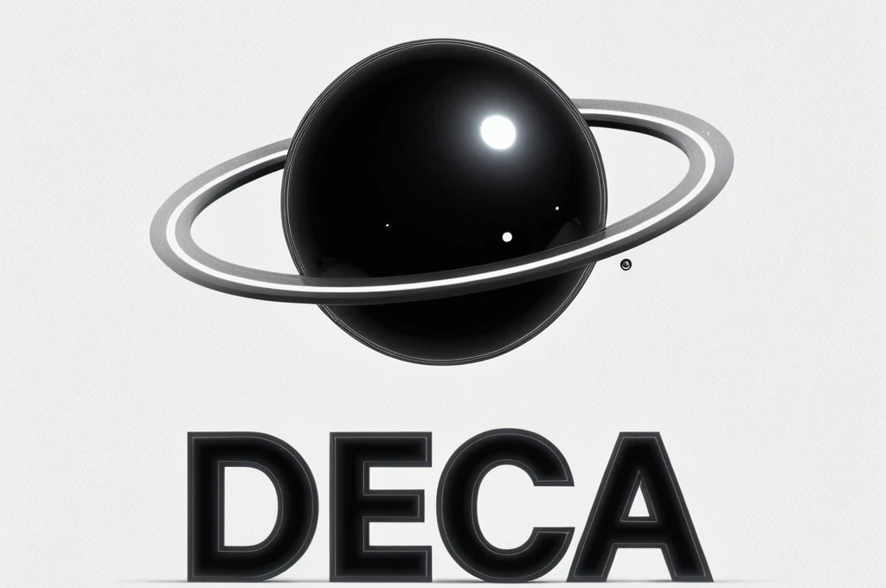

# Decentraling Encrypt Chat Application

> From My last side project [LCA](https://github.com/wang900115/LCA) come up with new idea 

## Overview
  **DECA** is a message chat hybrid system written in Go. It is designed for Decentralized encrypted communication. However, central management is still the priority for system security.

## Knowledge
  - **Decentral:** Decentral concept is this project main idea, like recurive peer2peer , and it cause to be community. each node be not only either giver still recevier. Staggered interact between userchain(which maintence by self) and channelchain(which maintence by governor).
  - **Encrypt:**  Using RSA Algorithm in sender side,and ASE Algorithm for message commonication.
  - **Failover:** In data stored and cache mechanism using postgresql and redis failover check (using first health)
  - **CQRS:** If just query from Reader service and update ...etc modify action from Writer service

## Prerequisite 
  - #### Golang Version > 1.24.4
  - #### Docker Installed (images come from pulling hub)
  - #### If using Local (should have postgresql server and redis service)

## Get Started
 > [!WARNING] if Using local please check prerequsite 
  - ### *Docker*
    - ##### Run:  `docker-compose up --build`
    - ##### ShutDowan:  `docker-compose down`
  - ### *Local* 
    - #### Window: 
      - ##### Build: `go build -o build ./cmd/LCA/main.go`
      - ##### Run: `./build/main.exe`
    - #### Linux:
      - ##### Build: `make build`
      - ##### Run: `make run`

## Question
  If you have any questions, please send me the ISSUE. I will personally understand and check if there are any omissions. Keep doing the best.

## Contributer
  - Main Dev: 
    - Name: Perry
## Licensing
  This project, Decentraling Encrypt Chat Application (DECA), is released under an open-source license to encourage collaboration, transparency, and innovation in decentralized secure communication systems. We currently use the following license: MIT License You are free to: Use, Copy, Modify, Merge, Publish, and Distribute the software Use it for personal, educational, or commercial purposes Provided that: You include the original copyright and license You provide attribution to the original authors For the full license text, refer to the LICENSE file in the repository.

